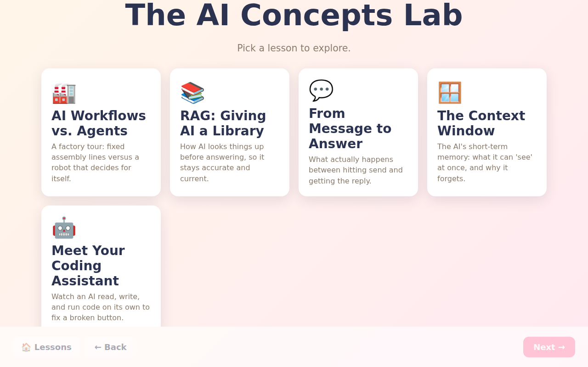
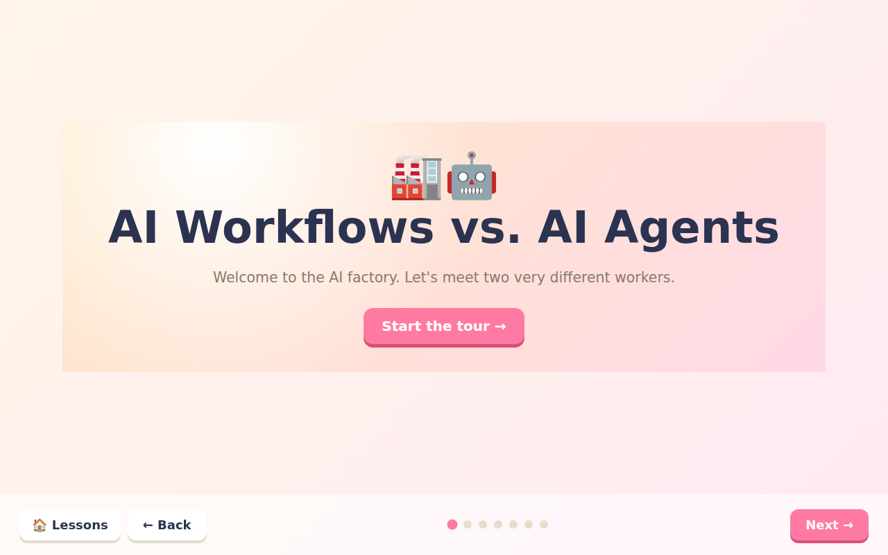
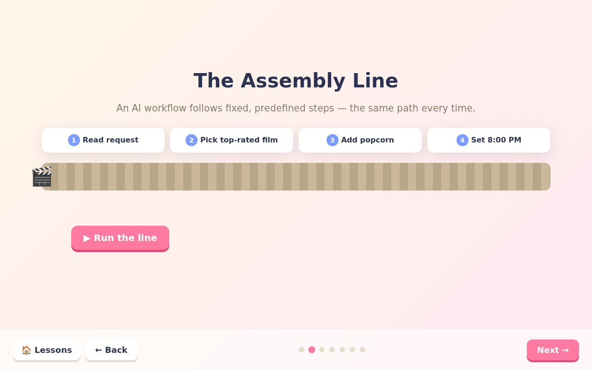
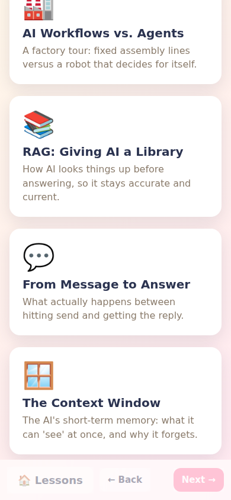
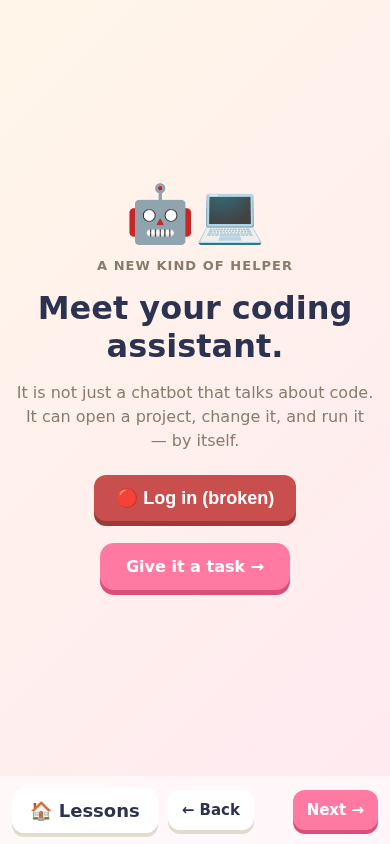
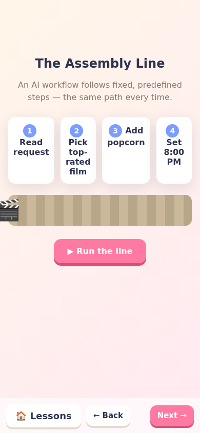

# Responsive screenshots

These screenshots show The AI Concepts Lab rendering correctly on desktop and
mobile. Desktop shots use a 1280x800 viewport. Mobile shots use a 390x844
viewport (iPhone-class size).

## Desktop (1280x800)

### Home hub

### Lesson intro

### Interactive scene

## Mobile (390x844)

### Home hub
The lesson cards stack into a single column and stay readable.

### Lesson intro
The hero title, buttons, and figure scale down to fit the narrow screen.

### Interactive scene
The step cards reflow and the nav bar keeps its controls reachable.

